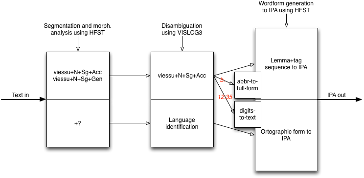

Preprocessing is our term for converting ortographic text to a string of IPA (or similar) symbols, suitable as input to the speech synthesis engine.

# Technologies

The preprocessing will be done with the following two technologies only:

* hfst
* vislcg3

Both HFST and VISLCG3 provides runtime C or C+ libraries. No scripted languages like Perl or Python, as they fit poorly for distribution as binary packages.

# Architecture

The basic architecture of the preprocessing can be illustrated with the following picture:



# Modifications compared to our regular development environment

In the regular processing of text we have the following pipeline:

```
text -> preprocess.pl -> morph. analysis (hfst/xerox) -> lookup2cg.pl -> disamb.
```

Now, because we can't rely on the availability of Perl, we can't use `preprocess.pl` nor `lookup2cg.pl`. Instead we need something based on `hfst-proc`. This entails a couple of things to be done:

* make sure the output from `hfst-proc` is correctly formatted as input to CG
  * we might need to modify `hfst-proc` for this
  * lemma must be surrounded by quotes
  * tags should be space-separated (can easily be done with symbol substitution)
  * we need to look into how tags for non-final parts in compounds are treated, to replicate functionality of `lookup2cg.pl`
    * it looks like it could be enough to just remove all tags used in such cases. This will increase the size of the transducer a bit, but hopefully not
    dramatically. Removing the tags must happen after we have given weights to the paths, as the weights will be given to the tags.
* we want to add weights to dynamic compounds and derivations, to allow `hfst-proc` to only output the simplest analyses (local disambiguation)
* since `hfst-proc` will do segmentation for us, we need to make sure all multiword expressions are covered in our lexicons as such

Another change is that to ensure round-trip consistency we need to make use of `+v1` tags, and also augment the morphological analysis with tags for all variation in the morphology, e.g. locatives on `–n`. The speech synthesis needs to **as closely as possible** render the input text, including misspellings and alternate (including non-standard) inflections and word forms.

# Benefits

With the proposed architecture we get a couple of benefits:

* proper disambiguation of G3 vs G2 grades in cases where the spelling is identical. This is actually a requirement, and the main reason for building a complex system. Without this disambiguation the synthesis would be wrong in many of these cases.
* the possibility of using the full syntax and dependency to identify phrase structures to base an augmented prosody model on
* a completely rule-based and transparent system

# Drawbacks and their counteractions

The main drawback is that we get a much more complex system, which increases the risk of introducing bugs and errors. We thus need to compensate this by testing each component of the pipeline thoroughly, and also the total package.
